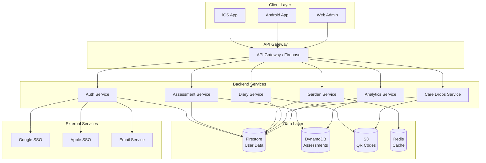
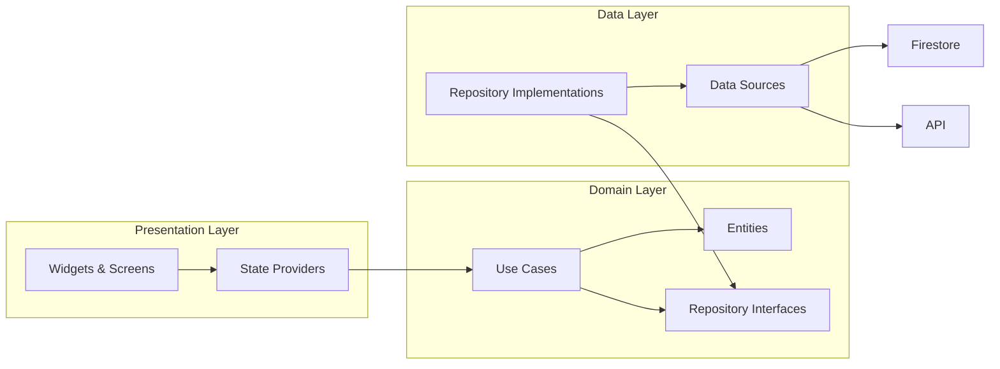
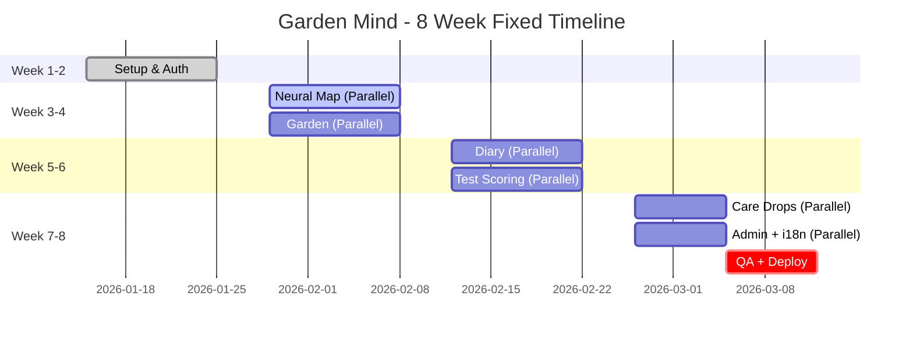
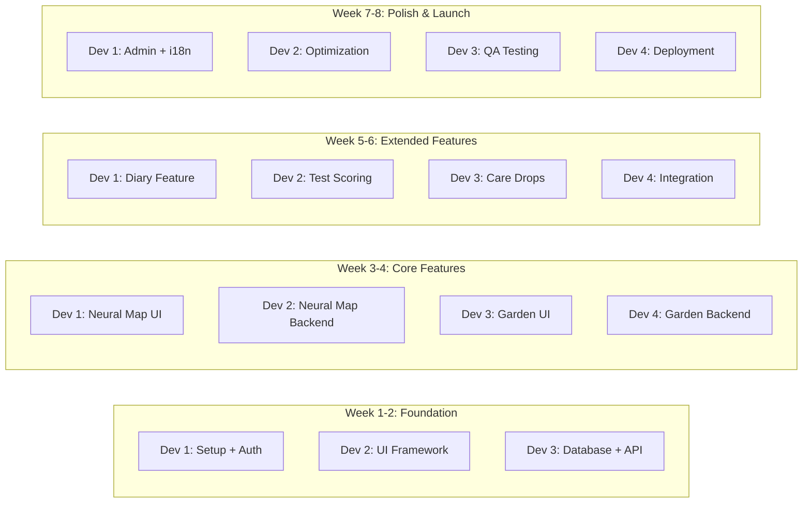
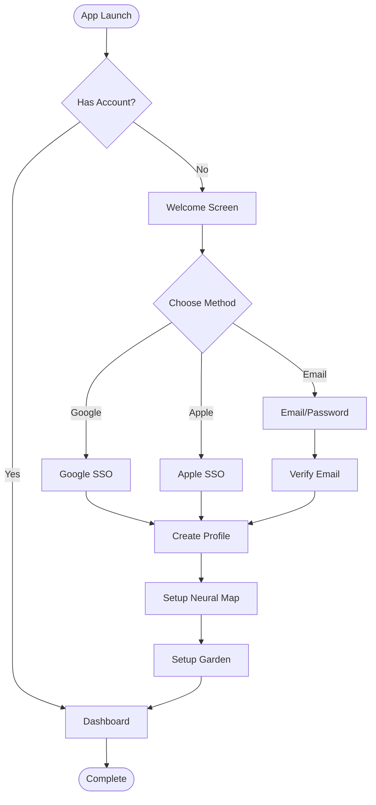
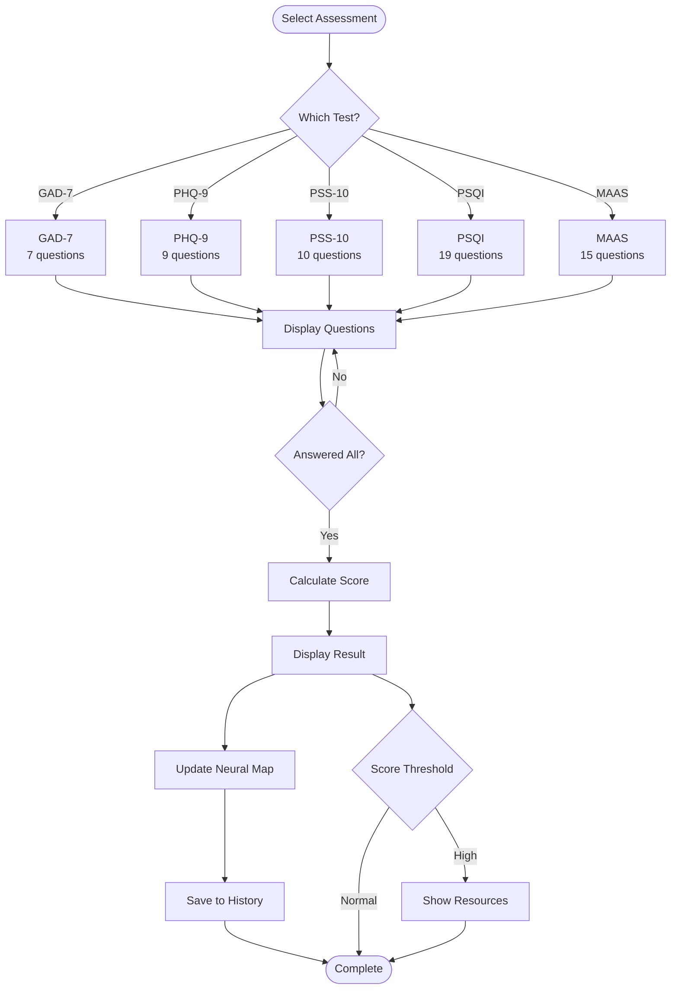
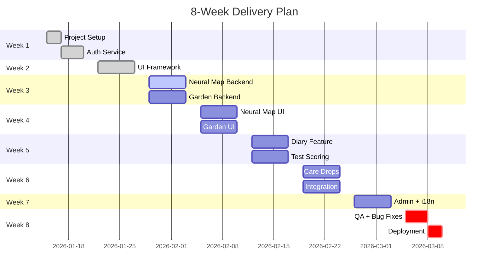
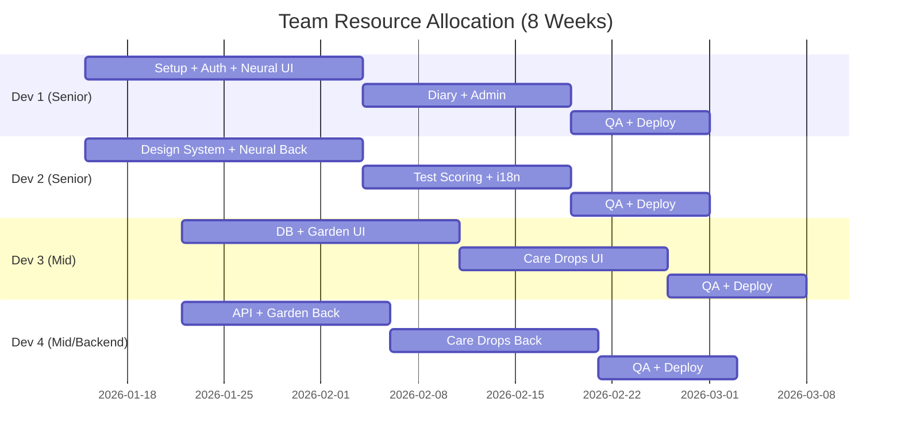

# PHÂN TÍCH KỸ THUẬT & BÁO GIÁ GIA CÔNG (TỪ ZERO - 8 TUẦN FIX)

## Garden Mind Wellness Application

---

## I. TỔNG QUAN DỰ ÁN

### 1.1 Mô tả dự án

**Garden Mind** là một ứng dụng sức khỏe tinh thần (mental wellness) giúp người dùng phát triển nhận thức bản thân thông qua các phép trực quan hóa đẹp mắt. Ứng dụng kết hợp giữa:

- **Trực quan hóa dữ liệu**: Bản đồ neural (neural map) và khu vườn tâm trí (mind garden)
- **Đánh giá tâm lý**: Các bài test chuẩn hóa (GAD-7, PHQ-9, v.v.)
- **Journaling**: Nhật ký hàng ngày với theo dõi tâm trạng
- **Hỗ trợ đồng đẳng**: Kết nối ẩn danh qua QR code

### 1.2 Timeline Constraint

**IMPORTANT**: Timeline cố định là **8 TUẦN** - không thể kéo dài. Điều này yêu cầu:

- Team size lớn hơn (3-4 developers)
- Parallel development tối đa
- Strict scope control
- Weekly delivery milestones

### 1.3 Tech Stack

| Layer            | Technology           | Lý do chọn                         |
| ---------------- | -------------------- | ------------------------------------ |
| Frontend         | Flutter 3.19+        | Cross-platform, performance, rich UI |
| State Management | Riverpod 2.5+        | Reactive, type-safe, testable        |
| Navigation       | Go Router 14+        | Declarative, deep linking support    |
| Backend          | Firebase / Node.js   | Serverless, scalable, real-time      |
| Database         | Firestore + DynamoDB | NoSQL, real-time sync, HIPAA-ready   |
| Auth             | Firebase Auth        | SSO support, secure, HIPAA-compliant |
| Admin Panel      | Flutter Web / React  | Code reuse, fast development         |
| DevOps           | GitHub Actions       | CI/CD, automated testing             |

---

## II. ARCHITECTURE DIAGRAMS

### 2.1 System Architecture Overview



### 2.2 Application Architecture (Clean Architecture)



---

## III. 8-WEEK FIXED TIMELINE WORKFLOW

### 3.1 Development Timeline (Gantt)



### 3.2 Weekly Milestones

| Week | Milestone           | Deliverables               | Team Size |
| ---- | ------------------- | -------------------------- | --------- |
| 1    | Project Kickoff     | Setup, Auth, DB schema     | 3 devs    |
| 2    | Foundation Complete | UI framework, API base     | 3 devs    |
| 3    | Neural Map Alpha    | 35 nodes, assessment flow  | 3-4 devs  |
| 4    | Garden Alpha        | 31 flowers, check-in       | 3-4 devs  |
| 5    | Diary + Test Beta   | Diary, test scoring        | 4 devs    |
| 6    | Care Drops Beta     | QR matching, chat          | 4 devs    |
| 7    | Polish Phase        | Admin, i18n, optimization  | 4 devs    |
| 8    | Launch              | QA, TestFlight, deployment | 4 devs    |

### 3.3 Parallel Development Strategy



---

## IV. WORKFLOW DIAGRAMS

### 4.1 User Onboarding Flow



### 4.2 Assessment Flow



---

## V. DETAILED TASK BREAKDOWN (8 WEEKS)

### WEEK 1-2: FOUNDATION

#### Week 1: Setup & Infrastructure

**Task 1.1: Project Setup**

- Flutter project structure
- CI/CD pipeline
- Environment configuration
- **Assign**: Dev 1 | **Effort**: 8-10 giờ

**Task 1.2: Design System**

- Color palette, typography
- Base components
- Theme system
- **Assign**: Dev 2 | **Effort**: 16-20 giờ

**Task 1.3: Firebase & Database**

- Firebase setup
- Database schema
- Security rules
- **Assign**: Dev 3 | **Effort**: 12-16 giờ

**Task 1.4: Authentication**

- Google SSO, Apple SSO
- Email/password
- Session management
- **Assign**: Dev 1 | **Effort**: 16-20 giờ

**Task 1.5: API Gateway**

- REST API structure
- Error handling
- **Assign**: Dev 3 | **Effort**: 10-12 giờ

**Week 1 Total**: 62-78 giờ

#### Week 2: UI Framework & Base Features

**Task 2.1: Navigation & Routing**

- Go Router setup
- Route guards
- **Assign**: Dev 1 | **Effort**: 6-8 giờ

**Task 2.2: State Management**

- Riverpod providers
- State patterns
- **Assign**: Dev 2 | **Effort**: 8-10 giờ

**Task 2.3: Base Screens**

- Home, Settings, Profile
- Loading/error states
- **Assign**: Dev 2 | **Effort**: 12-16 giờ

**Task 2.4: Data Models**

- User, Assessment, Garden models
- Repository interfaces
- **Assign**: Dev 3 | **Effort**: 10-12 giờ

**Week 2 Total**: 36-46 giờ

**Week 1-2 Combined**: 98-124 giờ

---

### WEEK 3-4: CORE FEATURES (PARALLEL)

#### Week 3-4: Neural Map (Dev 1 + Dev 2)

**Task N1: Neural Map Backend**

- Assessment data models
- Scoring engine (5 algorithms)
- Neural state management
- **Assign**: Dev 2 | **Effort**: 24-30 giờ

**Task N2: Neural Map UI**

- 35-node visualization
- Custom painter
- Animations
- Touch interaction
- **Assign**: Dev 1 | **Effort**: 28-35 giờ

**Task N3: Assessment Flow**

- Question screens
- Answer selection
- Results display
- History list
- **Assign**: Dev 1 | **Effort**: 16-20 giờ

**Neural Map Total**: 68-85 giờ

#### Week 3-4: Mind Garden (Dev 3 + Dev 4)

**Task G1: Garden Backend**

- Flower data models (31 flowers)
- Health calculation
- Streak logic
- **Assign**: Dev 4 | **Effort**: 16-20 giờ

**Task G2: Garden UI**

- 31-flower visualization
- 8 flower types
- Growth animations
- Atmospheric effects
- **Assign**: Dev 3 | **Effort**: 24-30 giờ

**Task G3: Daily Check-in**

- Question flow
- Mood picker
- Gamification
- **Assign**: Dev 3 | **Effort**: 12-16 giờ

**Garden Total**: 52-66 giờ

**Week 3-4 Combined**: 120-151 giờ

---

### WEEK 5-6: EXTENDED FEATURES (PARALLEL)

#### Week 5-6: Mini Diary (Dev 1)

**Task D1: Diary Backend**

- Entry models
- CRUD operations
- Search indexing
- **Assign**: Dev 1 | **Effort**: 12-16 giờ

**Task D2: Diary UI**

- Entry creation
- Rich text editor
- List & filters
- **Assign**: Dev 1 | **Effort**: 16-20 giờ

**Task D3: Garden Integration**

- Tap flower → entry
- Mood linkage
- **Assign**: Dev 1 | **Effort**: 6-8 giờ

**Diary Total**: 34-44 giờ

#### Week 5-6: Test Scoring (Dev 2)

**Task T1: Test Management**

- Question bank CRUD
- Assessment config
- **Assign**: Dev 2 | **Effort**: 12-16 giờ

**Task T2: Test Taking UI**

- Test selection
- Question flow
- Progress tracking
- **Assign**: Dev 2 | **Effort**: 14-18 giờ

**Task T3: Results & History**

- Score display
- Trends visualization
- **Assign**: Dev 2 | **Effort**: 10-12 giờ

**Test Scoring Total**: 36-46 giờ

#### Week 5-6: Care Drops (Dev 3 + Dev 4)

**Task C1: QR & Matching Backend**

- QR generation/validation
- Anonymous pairing
- **Assign**: Dev 4 | **Effort**: 14-18 giờ

**Task C2: Messaging Backend**

- Real-time messaging
- Encryption
- **Assign**: Dev 4 | **Effort**: 16-20 giờ

**Task C3: Care Drops UI**

- QR scanner
- Chat interface
- Privacy controls
- **Assign**: Dev 3 | **Effort**: 22-28 giờ

**Care Drops Total**: 52-66 giờ

**Week 5-6 Combined**: 122-156 giờ

---

### WEEK 7: POLISH & INTEGRATION

**Task P1: Admin Dashboard**

- Assessment management
- User management
- Analytics
- **Assign**: Dev 1 | **Effort**: 20-24 giờ

**Task P2: Multi-language**

- i18n setup
- EN/VN translations
- **Assign**: Dev 2 | **Effort**: 16-20 giờ

**Task P3: Performance Optimization**

- Animation optimization
- Memory management
- **Assign**: Dev 3 | **Effort**: 12-16 giờ

**Task P4: Integration Testing**

- Cross-feature testing
- Bug fixes
- **Assign**: Dev 4 | **Effort**: 16-20 giờ

**Week 7 Total**: 64-80 giờ

---

### WEEK 8: QA & LAUNCH

**Task Q1: Unit Testing**

- Business logic tests
- Service tests
- **Assign**: Dev 1 | **Effort**: 12-16 giờ

**Task Q2: Integration Testing**

- API tests
- Auth flows
- **Assign**: Dev 2 | **Effort**: 10-12 giờ

**Task Q3: UI Testing**

- Widget tests
- Screenshot tests
- **Assign**: Dev 3 | **Effort**: 10-12 giờ

**Task Q4: Deployment**

- App Store prep
- Play Store prep
- TestFlight/Play Internal
- **Assign**: Dev 4 | **Effort**: 12-16 giờ

**Task Q5: Documentation**

- Technical docs
- Admin guide
- Handover
- **Assign**: All | **Effort**: 8-10 giờ

**Week 8 Total**: 52-66 giờ

---

## VI. EFFORT SUMMARY

### 6.1 Total Effort by Week

| Week | Focus Area           | Hours                  | Team Size                   |
| ---- | -------------------- | ---------------------- | --------------------------- |
| 1-2  | Foundation           | 98-124                 | 3 devs                      |
| 3-4  | Neural + Garden      | 120-151                | 4 devs                      |
| 5-6  | Diary + Test + Care  | 122-156                | 4 devs                      |
| 7    | Polish + Integration | 64-80                  | 4 devs                      |
| 8    | QA + Launch          | 52-66                  | 4 devs                      |
|      | **TOTAL**      | **456-577 giờ** | **Average: 3.5 devs** |

### 6.2 Effort by Developer Role

| Role                      | Hours   | Weeks | Utilization |
| ------------------------- | ------- | ----- | ----------- |
| Senior Flutter Dev 1      | 130-165 | 8     | 81-103%     |
| Senior Flutter Dev 2      | 126-160 | 8     | 79-100%     |
| Mid Flutter Dev 3         | 114-144 | 8     | 71-90%      |
| Mid Flutter/Backend Dev 4 | 86-108  | 8     | 54-68%      |

---

## VII. BÁO GIÁ CHI TIẾT (8 TUẦN FIX)

### 7.1 Pricing Calculation

**Effort-Based Pricing**:

| Role                    | Hours   | Rate                 | Subtotal       |
| ----------------------- | ------- | -------------------- | -------------- |
| Senior Flutter Dev (x2) | 256-325 | $45 | $11,520-14,625 |                |
| Mid Flutter Dev (x2)    | 200-252 | $35 | $7,000-8,820   |                |
| UI/UX Designer          | 40-50   | $35 | $1,400-1,750   |                |
| QA Engineer             | 30-40   | $25 | $750-1,000     |                |
| DevOps                  | 16-20   | $45 | $720-900       |                |
| Project Manager         | 32-40   | $40 | $1,280-1,600   |                |
|                         |         | **RAW TOTAL**  | $22,670-28,695 |

**Timeline Premium** (+20% cho 8-week crunch):

- Base: $22,670-28,695
- Premium: $4,534-5,739
- **SUBTOTAL**: $27,204-34,434

**Discount cho package**: 10-15%
**FINAL PRICING** : $24,500 - $31,000

### 7.2 Pricing Options

#### Option 1: MVP 8-Week Fast-Track

**Scope**:

- Tất cả tính năng core
- UI polish standard (không premium)
- Animation cơ bản
- Multi-language EN/VN
- Admin dashboard cơ bản
- QA & deployment

**Pricing**:

- **Giá: $24,500 - $28,000**
- Timeline: **8 TUẦN FIX**
- Team: 3-4 developers
- Payment: 30% kickoff, 40% week 4, 30% delivery

#### Option 2: MVP 8-Week Premium

**Scope** (Fast-Track +):

- Enhanced UI polish
- Micro-interactions
- Performance optimization
- Advanced admin analytics
- Priority support

**Pricing**:

- **Giá**: $28,000 - $31,000
- Timeline: **8 TUẦN FIX**
- Team: 4 developers
- Payment: 30% kickoff, 40% week 4, 30% delivery

#### Option 3: Phased Delivery (Still 8 weeks total)

**Week 1-4**: Core MVP ($14,000-16,000)

- Auth + Neural Map + Garden + Test

**Week 5-8**: Extended Features ($12,000-15,000)

- Diary + Care Drops + Admin + i18n

**TOTAL**: $26,000 - $31,000

### 7.3 Payment Schedule (8-Week Timeline)

| Milestone              | Week | %              | Amount (Option 1)                                   | Amount (Option 2) |
| ---------------------- | ---- | -------------- | --------------------------------------------------- | ----------------- |
| Deposit                | 1    | 30%            | $7,350-8,400 | $8,400-9,300                         |                   |
| Foundation Complete    | 2    | 20%            | $4,900-5,600 | $5,600-6,200                         |                   |
| Core Features Complete | 4    | 25%            | $6,125-7,000 | $7,000-7,750                         |                   |
| Launch Ready           | 8    | 25%            | $6,125-7,000 | $7,000-7,750                         |                   |
|                        |      | **100%** | **$24,500-28,000** | **$28,000-31,000** |                   |

---

## VIII. RỦI RO & PHƯƠNG PHÁP (8 TUẦN)

### 8.1 Risk Matrix (Tight Timeline)

**Risk Assessment Visualization**:

```
HIGH PROBABILITY
    ^
    |
    |        [Scope Creep]        [Timeline Slippage]
    |        (HIGH, HIGH)          (HIGH, HIGH)
    |
    |                                             [Quality Issues]
    |                                             (MEDIUM, HIGH)
    |
MID-+----------------------------------------------> HIGH IMPACT
    |   [Team Burnout]        [Integration Issues]
    |   (MEDIUM, MEDIUM)       (MEDIUM, MEDIUM)
    |
    |
    v
LOW PROBABILITY
```

**Risk Scoring**:

| Risk               | Probability (0-1) | Impact (0-1) | Overall Score | Risk Level  |
| ------------------ | ----------------- | ------------ | ------------- | ----------- |
| Scope Creep        | 0.8               | 0.7          | 0.77          | HIGH        |
| Timeline Slippage  | 0.9               | 0.8          | 0.85          | CRITICAL    |
| Quality Issues     | 0.7               | 0.6          | 0.65          | HIGH        |
| Team Burnout       | 0.6               | 0.5          | 0.55          | MEDIUM      |
| Integration Issues | 0.7               | 0.6          | 0.65          | MEDIUM-HIGH |

**Calculation**: Overall = (Probability × 0.6) + (Impact × 0.4)

### 8.2 Mitigation Strategies

| Rủi ro            | Probability | Impact | Mitigation                                                  |
| ------------------ | ----------- | ------ | ----------------------------------------------------------- |
| Timeline slippage  | HIGH        | HIGH   | Strict scope control, daily standups, buffer time in Week 8 |
| Quality issues     | MEDIUM      | HIGH   | Automated testing, code reviews, QA dedicated Week 8        |
| Scope creep        | HIGH        | HIGH   | Change request process, any addition replaces something     |
| Team burnout       | MEDIUM      | MEDIUM | 4 devs to share load, no overtime expectation               |
| Integration issues | MEDIUM      | MEDIUM | Weekly integration, continuous deployment                   |

### 8.3 Success Factors for 8-Week Delivery

1. **Scope Frozen**: No new features after Week 1
2. **Parallel Development**: 3-4 devs working simultaneously
3. **Daily Communication**: Standups + Slack
4. **Weekly Demos**: Every Friday demo
5. **QA From Week 3**: Testing starts early, not Week 8
6. **Cut Scope If Needed**: Care Drops can move to Phase 2 if timeline at risk

---

## IX. TIMELINE VISUALIZATION

### 9.1 Week-by-Week Breakdown



### 9.2 Team Allocation Timeline



---

## X. KẾT LUẬN

### Tóm tắt proposal (8 TUẦN FIX):

- **Timeline**: **8 TUẦN** (không thương lượng)
- **Total effort**: 456-577 giờ
- **Team size**: 3-4 developers (peak Week 3-6)
- **Pricing**: $24,500-28,000 (Standard) hoặc $28,000-31,000 (Premium)
- **Risk**: Higher due to tight timeline
- **Mitigation**: Parallel development, scope control, daily communication

### Key Commitments:

1. **Timeline**: 8 weeks fixed - any scope changes must trade off
2. **Quality**: Full QA in Week 8, no shortcuts
3. **Communication**: Daily standups, weekly demos
4. **Delivery**: TestFlight + Play Internal Testing by Week 8

### Next Steps:

1. Confirm option (Standard $24.5-28k hoặc Premium $28-31k)
2. Finalize scope (freeze sau Week 1)
3. Schedule kickoff (Week 1, Day 1)
4. Mobilize team (3-4 developers ready)

---

*(BA - Lương Quốc Lộc - Chuyên gia Tư vấn Trưởng, 30+ năm kinh nghiệm)*
